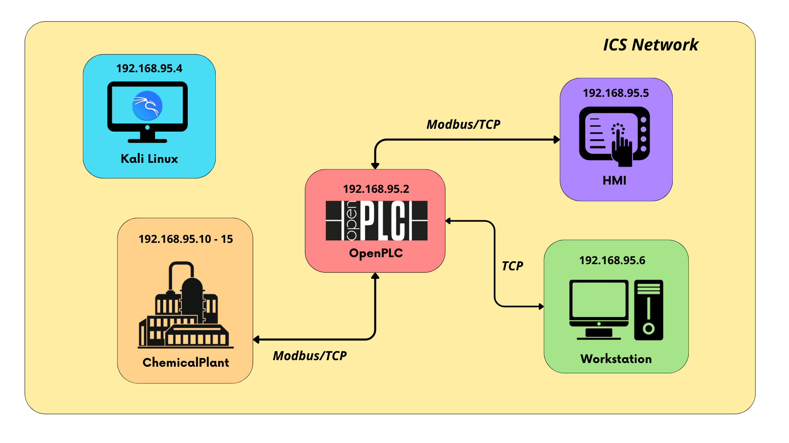

# An hybrid framework for SCADA cyber attack dataset generation

## Table of contents
- [Project Overview](#project-overview)
- [Architecture](#architecture)
- [Initial Steps](#initial-steps)
- [Authors](#authors)

## Project Overview
...

## Architecture
The architecture of this project represents a simulation of an Industrial Control System consisting of the following virtual machines:  
- **ChemicalPlant**: runs a realistic simulation of a chemical plant that is controlled and monitored by simulated remote IO devices. These remote IO devices are monitored and controlled by the PLC;
- **plc_2**: represents the PLC and responds to Modbus/TCP requests;
- **ScadaBR**: represents a Human Machine Interface (HMI), used to monitor process measurements collected by the PLC and to send commands to the PLC;
- **Workstation**: virtual machine with software used for programming the OpenPLC
  
In addition to the virtual machines in the original testbed, a virtual machine was integrated with Kali Linux installed, which was indispensable for the next phases of the study.
<br>
<p align="center">
  
</p>

## Initial Steps
First of all you need to download the different virtual machines. This procedure assumes you're using VirtualBox.  
See [this document](vmware-fusion.md) if you're a macOS user who prefers to use VMWare Fusion, or encounters issues using VirtualBox.

1. **Download VMs**:
   - [Simulation VM](https://netorgft4230013-my.sharepoint.com/:u:/g/personal/dformby_fortiphyd_com/EaBeAxbF6xtEumdsJ7npVz0BeECJnseAMsfAbaLwV3sKOg?e=JRvkcS) - MD5=02af6c2502ecaab6c6d138deb560b27d
   - [HMI VM](https://www.mattrideout.com/courses/cs6263/GRFICSv3/ScadaBR.ova) - MD5=b951f5fbd896ace762537207de913393
   - [PLC VM](https://netorgft4230013-my.sharepoint.com/:u:/g/personal/dformby_fortiphyd_com/ER0pG_X5IRNCg477jf2ppo8BdN0t13t9vrNBH92_oOWOHA?e=hNeJ88) - MD5=0fbb1254fb166466496f2a48780ae774
   - [Workstation VM](https://www.mattrideout.com/courses/cs6263/GRFICSv3/workstation.ova) - MD5=8b41ee6597404b7c9e9acf7c2b1c3866

2. **Create Network**:  
   This procedure assumes you're using VirtualBox.
   - Click on *Tools* > *Network* 
   - Choose *NAT Networks* and create one
   - Rename as you like
   - In the properties section choose as IPV4 prefix *192.168.95.0/24* and enable *DHCP* 
   - Click on *Apply* to save properties

3. **Configuration of the VMs**:  
   The following procedure is common to all VMs.
   - Click on *Settings* > *Network*
   - Enable Network Adapter
   - In the section *Attached to:* choose NAT Network and in the name section, check whether this is the NAT network previously created
   - In the section *Promiscuous Mode:* choose *Allow All*  
   (In this testbed it was necessary to use a VM on which [Kali Linux](https://www.kali.org/get-kali/#kali-virtual-machines) was installed. The same network configuration was also done out for this VM.)

## VM credentials:
- Simulation (Chemical Plant): simulation | Fortiphyd  
- HMI (ScadaBR): scadabr | scadabr web console: admin | admin  
- PLC: user | password  
- Workstation: workstation | workstation  

## Use of the testbed
The testbed described above is made up of several virtual machines, and a specific order must be followed in order to avoid problems or incorrect exchange of packets between them. The precise order in which no problems were encountered is as follows: 
- First of all start PLC VM and HMI VM. After both have started, log in on both
- Start Workstation VM, the login will be automatic
- Finally start up Simulation VM, that represents the simulated chemical plant. For this VM, some steps must be taken for the simulated process to allow the simulated process to run:
  1. When the machine has booted up, log in and with the *ls* command you will see a folder called *GRFICSv2*
  2. Entering this folder reveals several directories. The directory we are interested in is *simulation_vm*
  3. There are other directories here too, we are interested in *simulation*
  4. Inside this folder is the *remote_io* folder that we are interested in
  5. Inside this folder there is an additional folder called *modbus*
  6. Several bash language scripts can be found in the modbus folder, but the main one is *run_all.sh*.
  7. With the command ``` sudo bash run_all.sh ``` and re-entering the password, we start the simulated system correctly.
  8. To sum up: *GRFICSv2 > simulation_vm > simulation > remote_io > modbus > run_all.sh*
     
## Architecture

## Authors
| Name | Description |
| --- | --- |
| <p dir="auto"><strong>Alessandro Macaro</strong> |<br>GitHub   - <a href="https://github.com/mtolkien">mtolkien</a></p><p dir="auto">Email - <a href="mailto:a.macaro@studenti.unisa.it">a.macaro@studenti.unisa.it</a></p><p dir="auto">LinkedIn - <a href="www.linkedin.com/in/alemacaro">Alessandro Macaro</a></p><br>|
